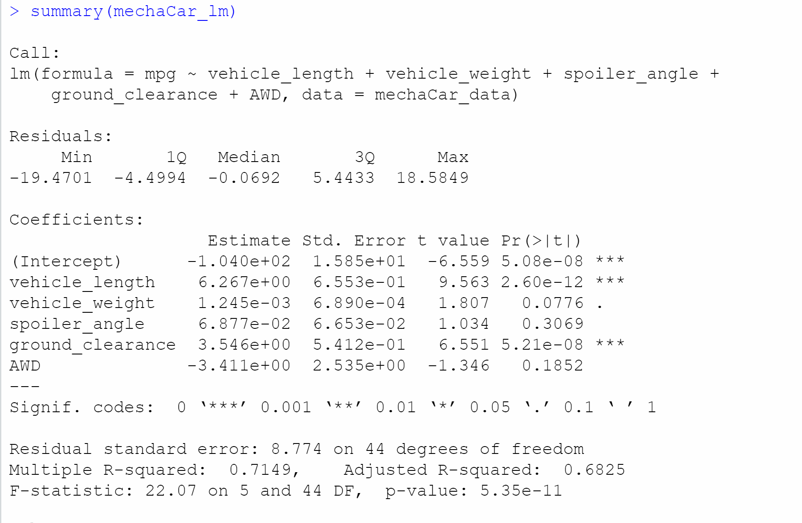
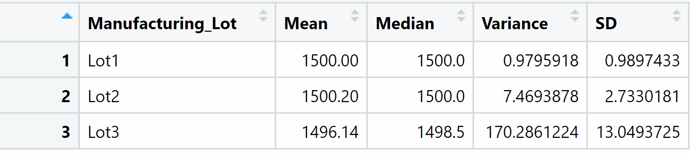
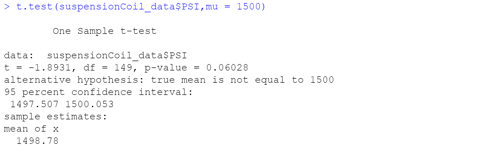
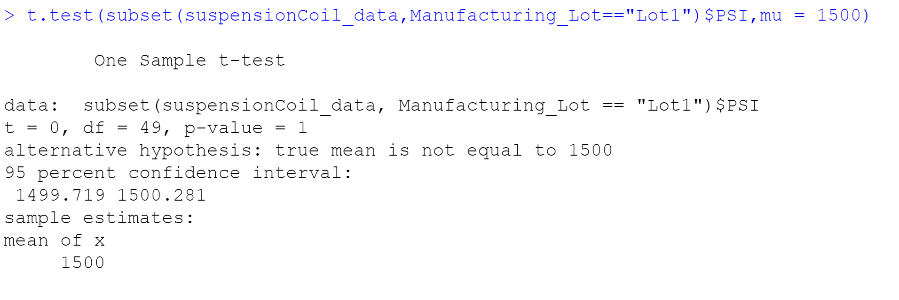
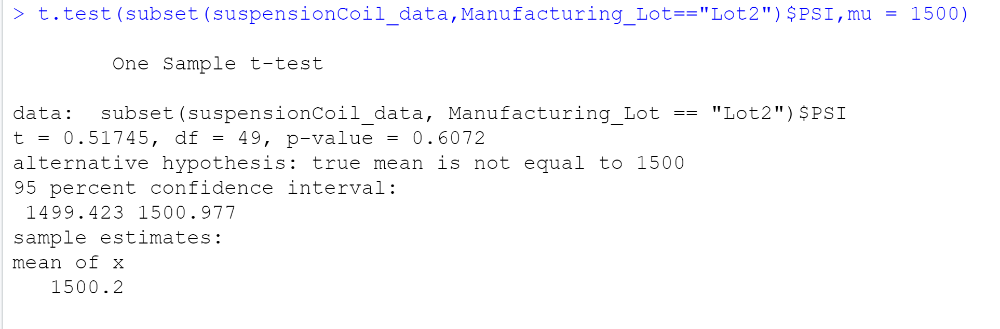
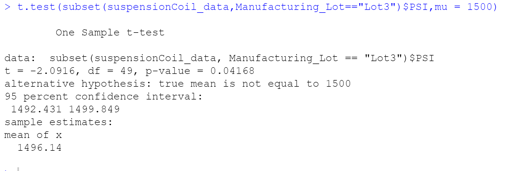

## Linear Regression to Predict

- The variable that provides a non-random amount of variance to the mpg values in the dataset is vehicle length and vehicle ground clearance because they have a significant impact on miles per gallon on the MechaCar prototype. The p-values of vehicle weight, spoiler angle, and all wheel drive indicate a random amount of variance with the dataset.

- The slope of this linear model is not zero because the p-value of this model is 5.35e-11 which is smaller than the significant level 0.05% and also give sufficient evidence to reject the null hypothesis. 

- The linear model does predict mpg of MechaCar prototypes effectively because the r-squared value is 0.7149, which means about 71% of all mpg predictions will be determines by this model. 

## Summary Statistics on Suspension

- Looking at summary statistics for the PSI of MechaCar suspension coils the variance of the coils is 62.29PSI, which meets the requirements specifications for the MechaCar suspension coils that dictates that the variance of the suspension coils must not exceed 100. 

- Looking at the summary statistics for the PSI of each MechaCar Manufacturing lot, Lot 1 and Lot 2 do meet the requirement specifications for the MechaCar suspension coils; with a variance of 0.98 and 7.47. However, Lot 3 is showing a mush larger variance of 170.29, therefore, does not meet the requirement specifications for MechaCar suspension coils.

## T-Tests on Suspension Coils

- The p-value for all manufacturing lots is  0.06, which is above the 0.05% significant level, which means that this data is not statistically significant and indicates strong evidence for the null hypothesis. 

- The p-value for all manufacturing lots is  1, which is above the 0.05% significant level. which means that this data is not statistically significant and indicates strong evidence for the null hypothesis. 

- The p-value for all manufacturing lots is  0.61, which is above the 0.05% significant level, which means that this data is not statistically significant and indicates strong evidence for the null hypothesis. 

- The p-value for all manufacturing lots is  0.04, which is below the 0.05% significant level, which means it is statistically significant. It indicates strong evidence against the null hypothesis, as there is less than a 5% probability the null is correct (and the results are random). 

## Study Design: MechaCar vs Competition

- I would conduct a One-Sample T-test which can quantify how the MechaCar performs against the competition. The metric I would use is horse power because it deals with the performance of the vehicle. Horse power is a unit of measurement that references the output engines or motors. A one-sample T-test would be best to find out is there a statical difference. The null hypothesis is that there is no statistical difference between MechaCar horse power vs the competitors. The alternative hypothesis is that there is a statistical difference between MechaCar horse power vs the competitors. The data needed is the horse power data, sample mean, the population mean, the sample standard deviation, and the number of observations.  

